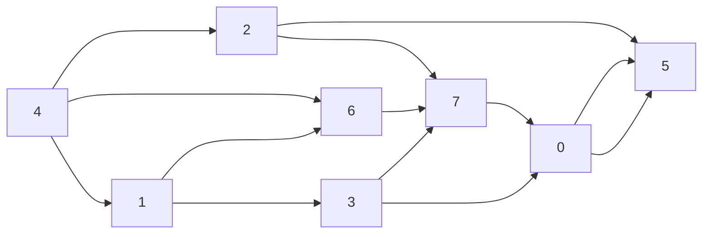
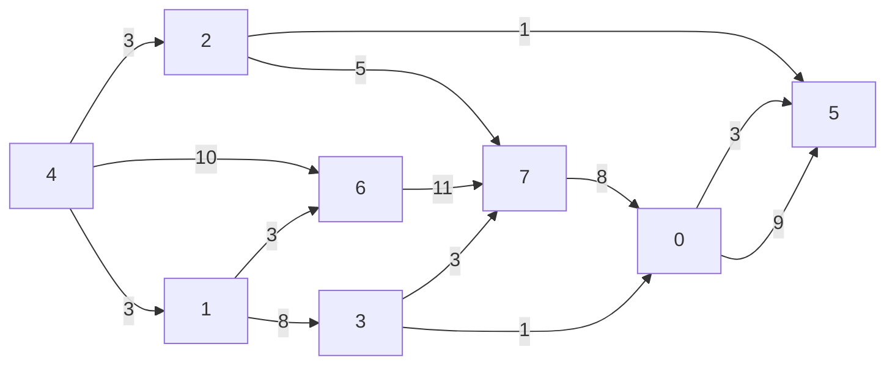
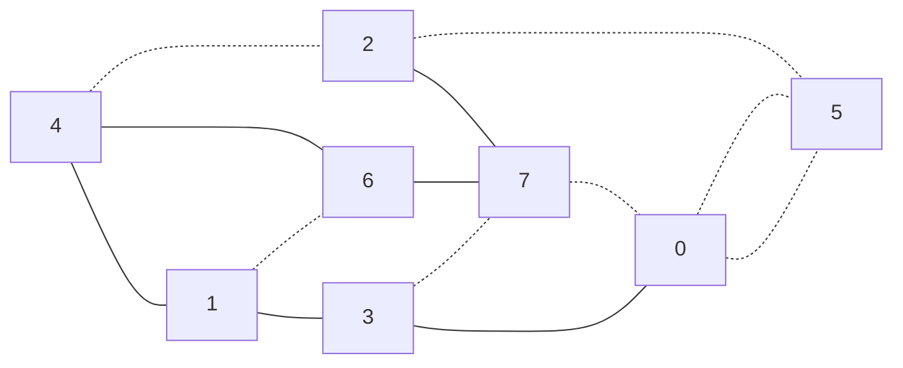
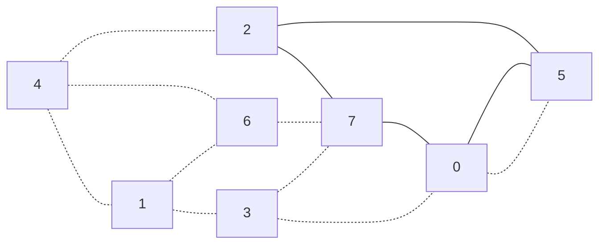
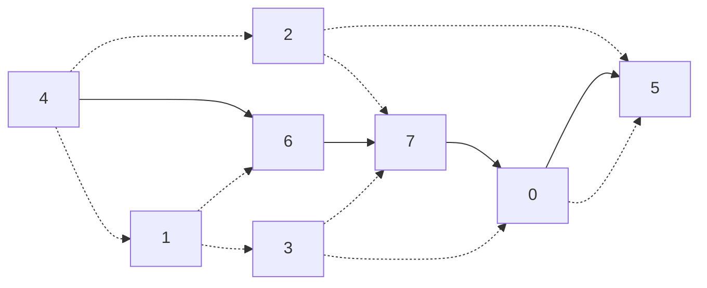
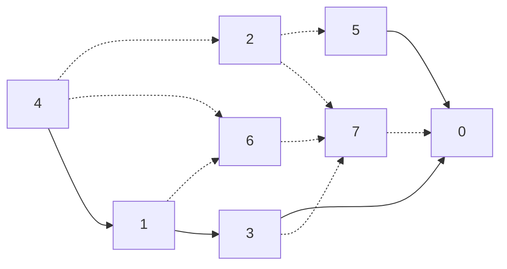
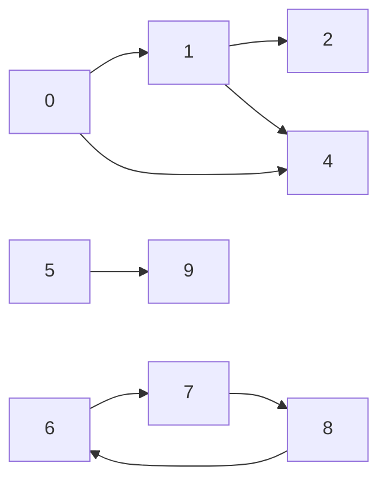
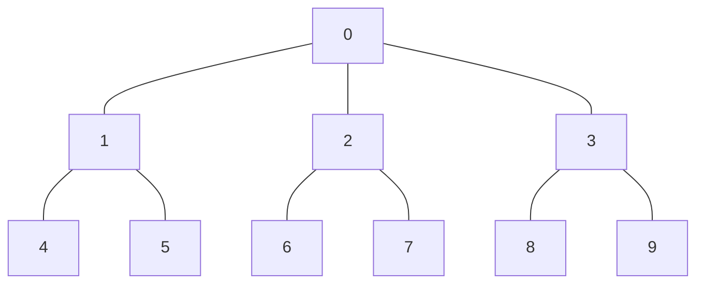
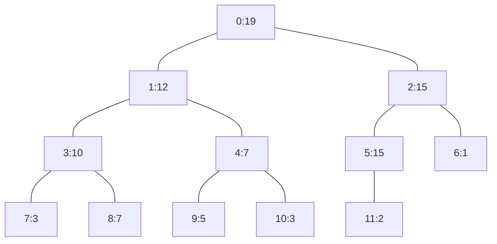

# グラフ

グラフGは頂点の集合$V = \{v_1, v_2, v_3, ... , v_N\}$とその頂点間を結ぶ辺の集合$E = \{e_1, e_2, e_3, .. ,e_N\}$によって
$G = (V,E)$として定義される。そのうち各辺$e_i \in E$に対して向きを考えるものを<b>有向グラフ</b>という。一方、各辺に対して向きを考えないものを
<b>無向グラフ</b>という。また、各辺$e_i \in E$に対して実数値もしくは整数値を対応させてグラフを考えることもある。これを<b>重み付きグラフ</b>という。

以下に有向グラフと無向グラフの例を示す。

## 有向グラフ

## 重み付きグラフ 

## 無向グラフ

## pathとcycle

グラフ$G =(V,E)$に対して$V$の部分集合$V^{\prime}$,と対応する$E$の部分集合$E^{\prime}$からなるグラフ$G^{\prime} = (E^{\prime},V^{\prime})$
を部分グラフという。

グラフ$G$上の頂点$s,t$が$s$から$t$へと辿ることが可能なときこの経路を$s-t$路またはウォーク(walk)といい$s$を始点、$t$を終点という。 
このウォークのうち始点と終点が等しいものを閉路またはサイクル(cycle)という。またウォークのうち同じ頂点を一回しか通らないものをパス(path)または道という。
またウォーク、パス、サイクルの長さとは重みなしグラフの場合ではそれらに含まれる辺の本数で重み付きグラフの場合では重みの和である。

以下にパス,サイクル、パスでないものを以下に示す。

### path

### cycle

### path

### pathでない

## 連結性

グラフ$G$の任意のニ点$s,t\in V$に対して$s-t$パスが存在するとき$G$は連結であるという。以下に連結でないグラフを示す。
連結でないグラフ$G$に対しても、連結なグラフの集合とみなすことが可能であることがある。
このとき$G$を構成するそれぞれの連結グラフを$G$の連結成分という。

### 連結でないグラフ

## グラフの表現

グラフの表現には<b>隣接リスト表現</b>と<b>隣接行列表現</b>がある。

## 木

- 木とは: サイクルのない無向グラフ 

## heapの定義

- 頂点$v$の親を$p$としたとき、key[p] $\ge$ key[v]
- 木の高さが$h$のとき木の深さが$h - 1$以下の部分については完全二分木を形成している
- 木の高さ$h$としたとき、木の深さ$h$の部分については頂点が左詰められている。 

