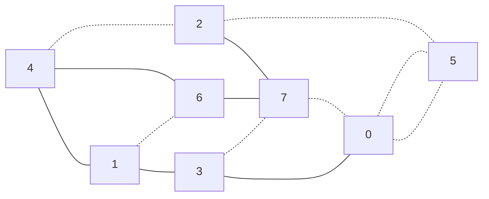
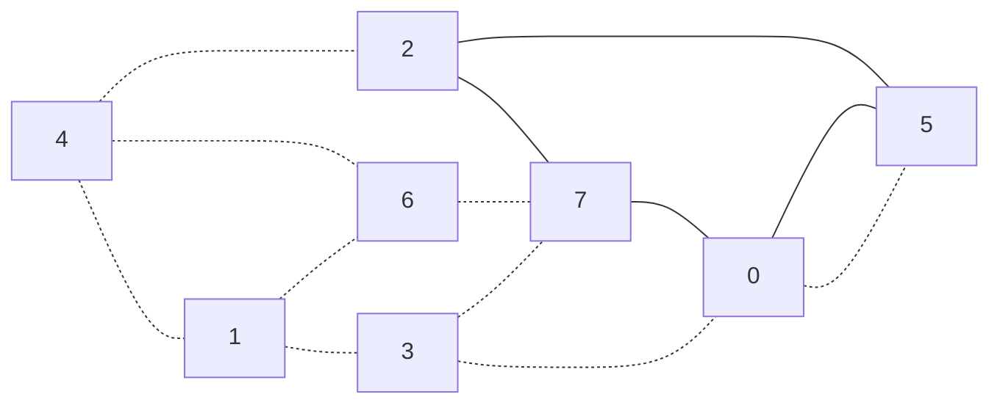
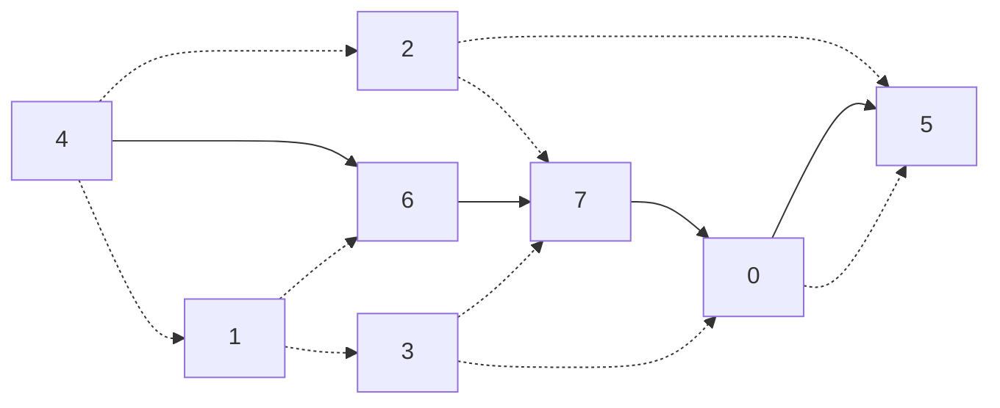
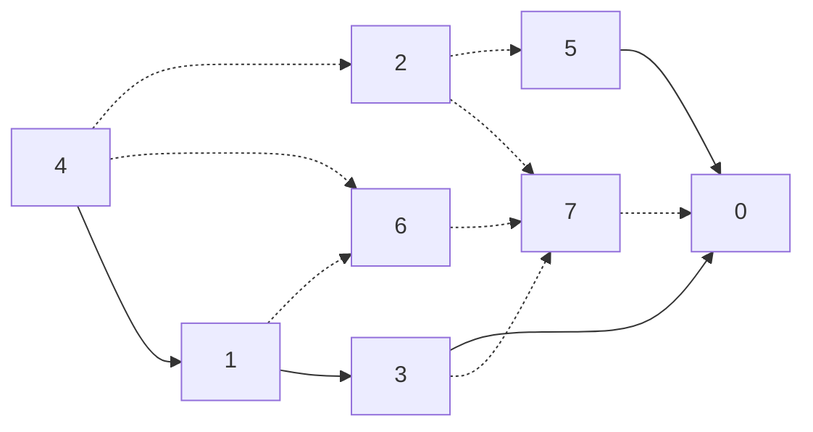
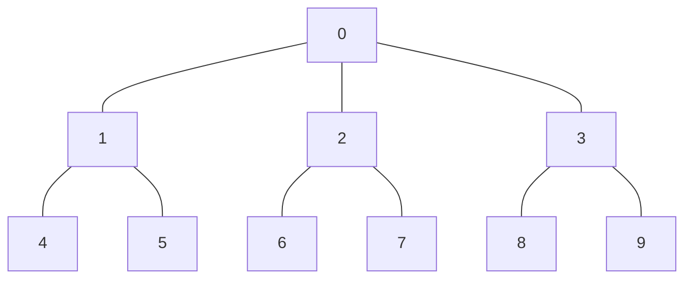
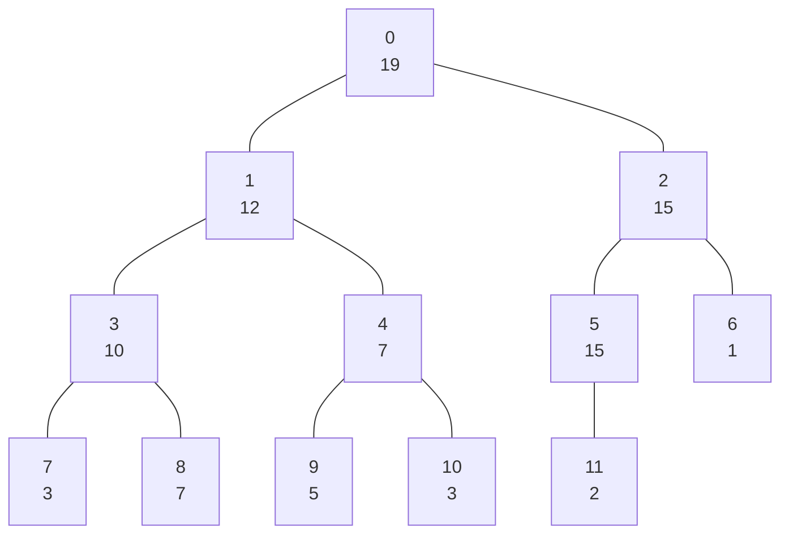

# グラフ

## 有向グラフ


```mermaid
graph LR
    4-->2-->5
    2--->7
    4-->6-->7-->0-->5
    1--->6
    4-->1-->3-->0-->5
    3-->7 ```

## 無向グラフ

```mermaid
graph LR
    4---2---5
    2----7
    4---6---7---0---5
    1----6
    4---1---3---0---5
    3---7
```

## pathとcycle

### path


### cycle


### path


### pathでない


## 重み付きグラフ

## 木

- 木とは: サイクルのない無向グラフ 



## heapの定義

- 頂点$v$の親を$p$としたとき、key[p] $\ge$ key[v]
- 木の高さが$h$のとき木の深さが$h - 1$以下の部分については完全二分木を形成している
- 木の高さ$h$としたとき、木の深さ$h$の部分については頂点が左詰められている。 


