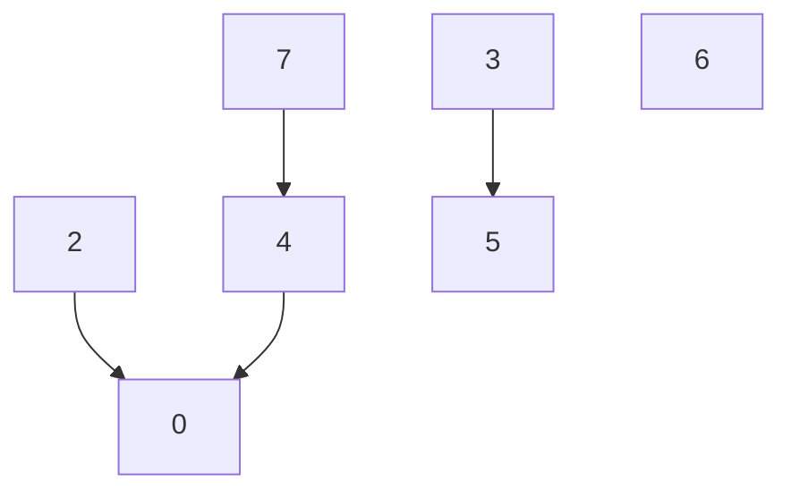
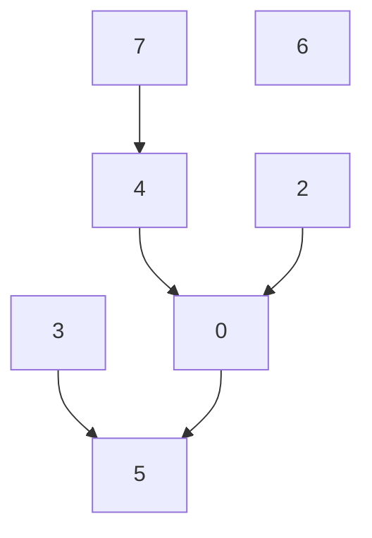
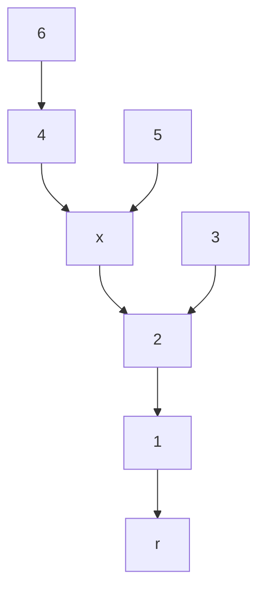
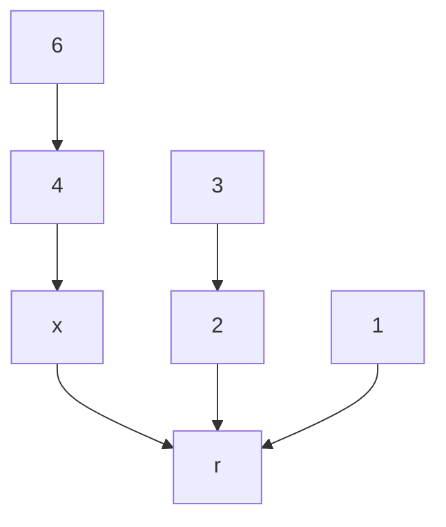

## Union-Find

Union-Findはグループ分けを行うデータ構造であり、以下のクエリを高速に実行することができる。

このデータ構造は一つのグループが一つの木で表現される。この木はヒープのように二分木である必要はない。

- issame(x,y): 要素 $x,y$ が同じグループに属するかを調べる
- unite(x,y): 要素 $x$ を含むグループと要素 $y$ を含むグループを併合する。
- root(x): $x$ を含む木の根を返す
- unite(x,y)する前


- unite(x,y)後


### 工夫

Union-Findは各クエリを高速化するために以下のような工夫をしている。

- union by size: 頂点数の多い木の根に頂点数の少ない木の根を子としてくっつける。

Union-Findでは各頂点 $x$ に対してroot(x)を求める処理が中核となっている。
木の高さが $h$ であるとするとroot(x)は $O(h)$ の計算量を要する。
そのため、要素数が $N$ であるとすると木の高さは最大で $N-1$ であるので計算量が $O(N)$ となる。

そこで、２つの木を併合する(union(x,y)する)際に要素数の小さい方の木を要素数の大きい方の木の子とする。
この工夫によって木の高さを $\log(N)$ に抑えることができる。

- 経路圧縮: 

経路圧縮を行わない場合の実装は以下のようになる。

経路圧縮の工夫がないとき
```C++
int root(int x) {
    if(par[x] == -1) return x;
    else return root(par[x]);
}
```

経路圧縮の工夫があるとき
```C++
int root(int x) {
    if(par[x] == -1) return x;
    else return par[x] = root(par[x]);
}
```

- root(x)を呼び出したときのUnion-Findの経路圧縮の様子





