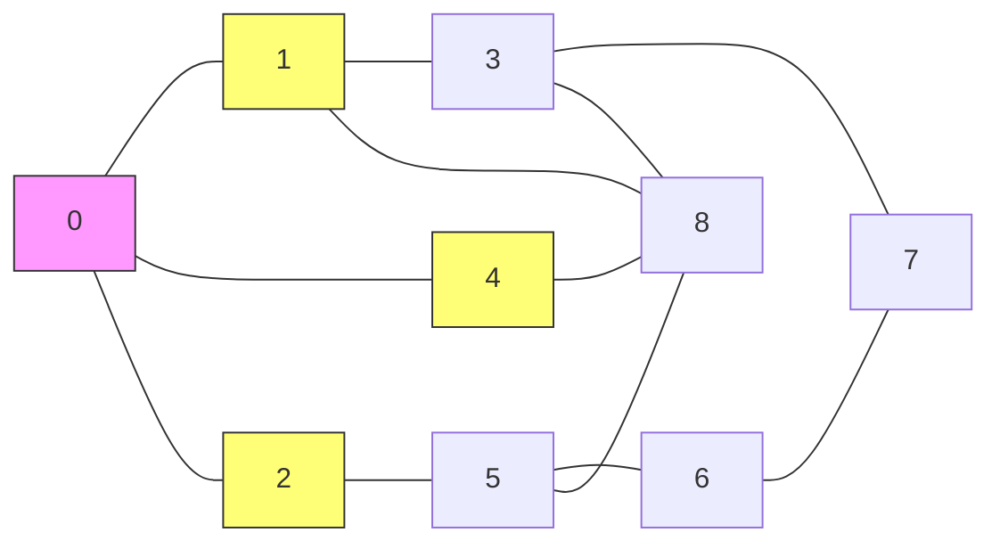
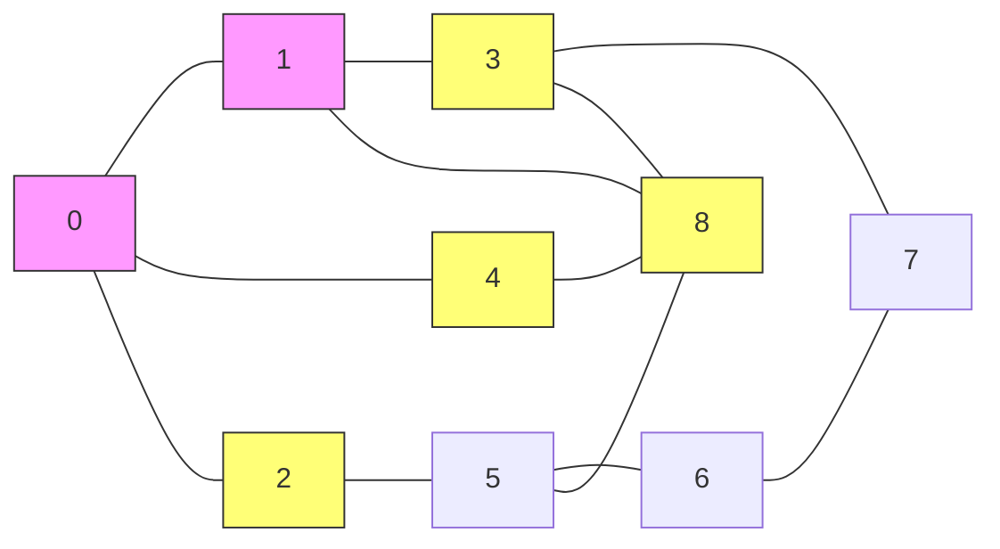
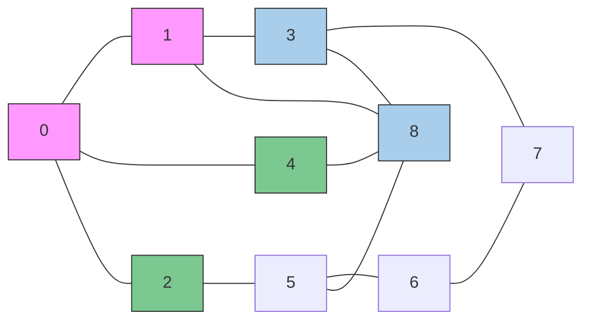

# グラフ探索

グラフ探索手法として代表的なものには<b>深さ優先探索(DFS: Depth First Search)</b>と<b>幅優先探索(BFS: Breadth First Search)</b>がある。以下ではその両方を俯瞰するために図を用いて説明する。

頂点 $0$よりスタートして隣接する頂点に進むことを考える。
下の図ではまず頂点 $0$を探索する。探索が終わった頂点はピンク色で示している。頂点 $0$ の次には隣接する頂点 $1,4,2$ が考えられる。
そこでこれらの頂点を"これから読む"という意味をこめた集合todoに入れる。集合todoに入れられた頂点は図中では黄色で示されている。

集合todoに入れられた頂点のうちここではまず、 頂点$1$に進むことを考える。(頂点 $2,4$ はとりあえず保留する)
頂点 $1$を探索し終えたならば次は隣接する頂点 $3,8$ ををtodoに加える。

次にどの集合todoからどの頂点を取り出すかでは二通りの方法が考えられる。

1. 直前に探索した頂点 $1$ から辿れる頂点 $(3,8)$ (水色) に進む
2. 最初一旦保留にした頂点 $(2,4)$ (緑色) に進む。

前者を<b>深さ優先探索(DFS)</b>といい後者を<b>幅優先探索(BFS)</b>という。
これらを実現するためにはtodoはDFSではスタックをBFSではキューを用いる。

