# グラフ探索

グラフ探索手法として代表的なものには<b>深さ優先探索(DFS: Depth First Search)</b>と<b>幅優先探索(BFS: Breadth First Search)</b>がある。以下ではその両方を俯瞰するために図を用いて説明する。

頂点 $0$よりスタートして隣接する頂点に進むことを考える。
下の図ではまず頂点 $0$ を探索する。探索が終わった頂点はピンク色で示している。頂点 $0$ の次には隣接する頂点 $1,4,2$ が考えられる。
そこでこれらの頂点を"これから読む"という意味をこめた集合todoに入れる。集合todoに入れられた頂点は図中では黄色で示されている。

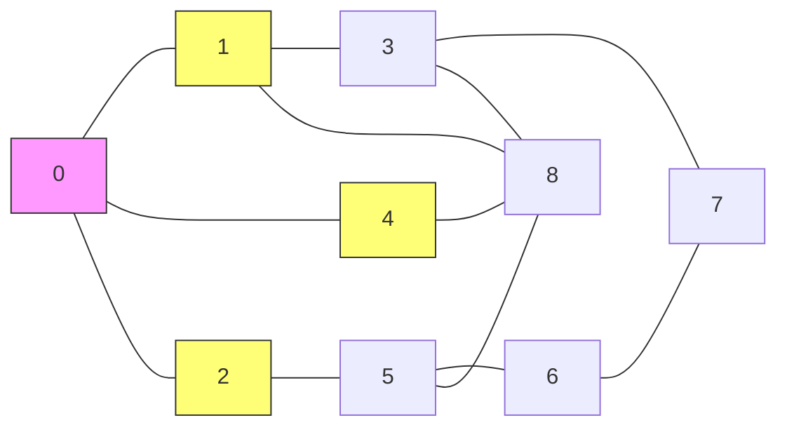

集合todoに入れられた頂点のうちここではまず、 頂点$1$に進むことを考える。(頂点 $2,4$ はとりあえず保留する)
頂点 $1$を探索し終えたならば次は隣接する頂点 $3,8$ ををtodoに加える。

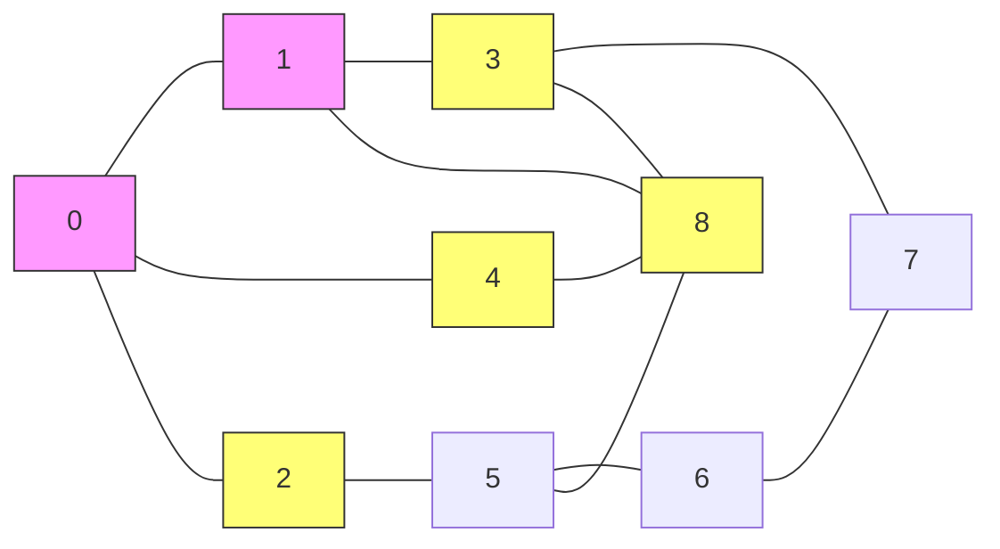

次にどの集合todoからどの頂点を取り出すかでは二通りの方法が考えられる。

1. 直前に探索した頂点 $1$ から辿れる頂点 $(3,8)$ (水色) に進む
2. 最初一旦保留にした頂点 $(2,4)$ (緑色) に進む。

前者を<b>深さ優先探索(DFS)</b>といい後者を<b>幅優先探索(BFS)</b>という。
これらを実現するためにはtodoはDFSではスタックをBFSではキューを用いる。
C++の場合の具体的なデータ型を以下の表にまとめておいた。

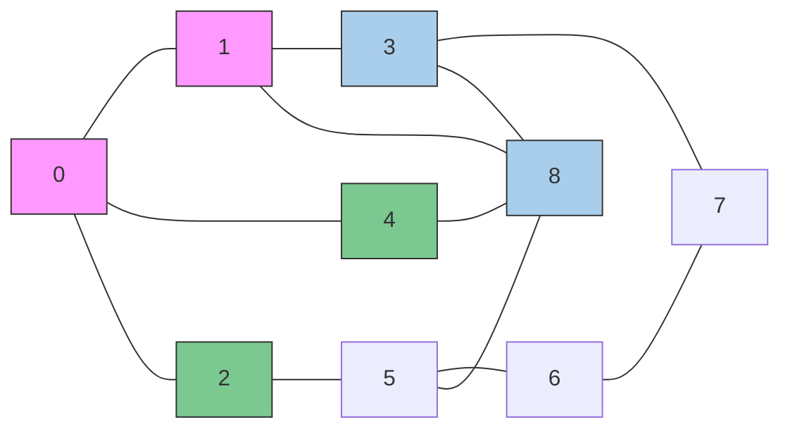

グラフ探索で用いる２つのデータ
| 変数名 | データ型 | 説明 |
|--------|----------|------|
| seen   | std::vector\<bool\> | seen[v]=trueのときその頂点vは訪問済み | 
| todo   | std::stack\<int\>またはstd::queue\<int\> | これから訪問する頂点を格納する | 

## 具体的なグラフに対する深さ優先探索の動き

ここでは13_1.cppで実装した再帰関数による深さ優先探索の実際の動きを具体的なグラフを例にして以下に示す。

1. まず、dfs(G,0)が呼び出され、頂点 $0$ に入り、頂点 $0$ が探索済みとなる。 
このとき頂点 $0$に隣接している頂点 $5$が探索予定の状態となる。
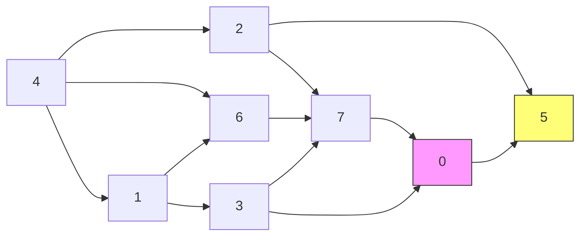

2. 1で探索予定としていた頂点 $5$ に入り、その後頂点 $5$ から辿れる頂点は存在しないため、
いったん再帰関数dfs(G,0)から抜ける。 
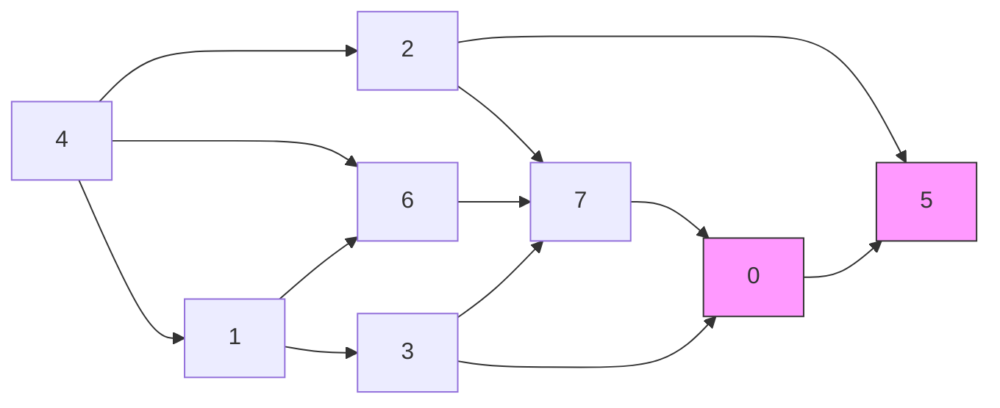

3. 次にmain関数内のforループに戻ってdfs(G,1)が呼び出され頂点 $1$ に入る。 
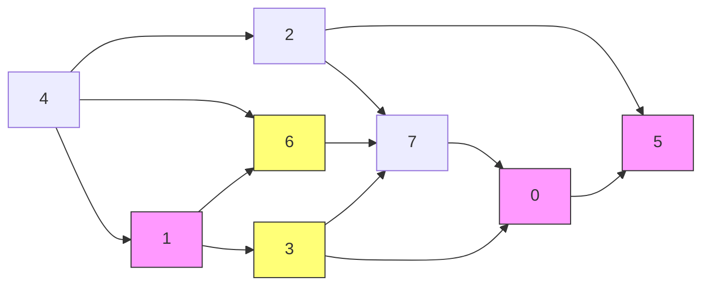

4. 頂点 $1$ に隣接している頂点は $3,6$ であるので、小さい頂点 $3$ に入る。 
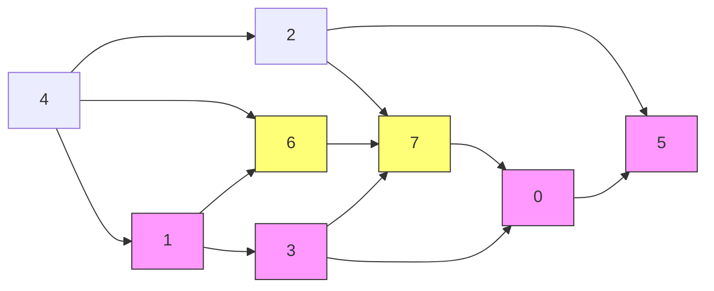

5. 頂点 $3$ に隣接している頂点は頂点 $0,7$ の二種類であるが、
頂点 $0$ は既に探索済み(seen[0]=true)であるので頂点 $7$ に入る。 
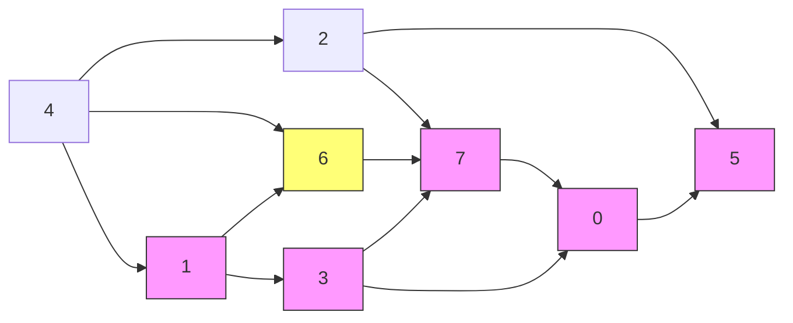

6. 頂点 $7$ からは頂点 $0$ へと行けるが、頂点 $0$ は既に訪問済みであるので
頂点 $7$ に関する再帰関数dfs(G,7)を抜けて、続いてdfs(G,3)を抜けて
関数dfs(G,1)に戻る。そして頂点 $1$ から行ける頂点 $6$ に行く。
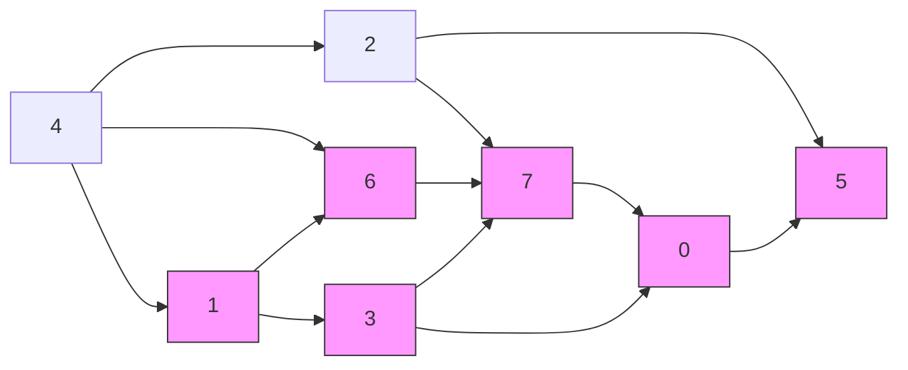

7. 頂点 $6$ から行ける頂点は全て探索済みとなているため、
頂点 $1$ に戻るが頂点 $1$ から行ける頂点も全て探索済みとなっているため
dfs(G,1)を抜けてmain関数に戻る。forループでdfs(G,2)が呼び出され、頂点 $2$ に入る。
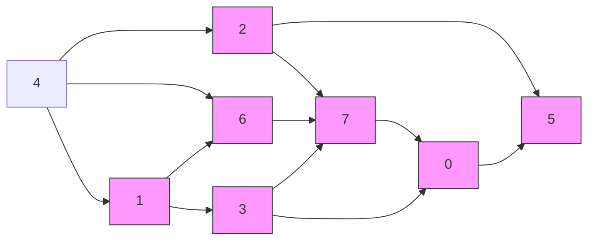

8. 頂点 $2$ から訪問できる頂点はすべて探索済みとなっているためすぐにdfs(G,2)を抜けてmain関数に戻り、forループで v = 3は既にseen[3] = true 
となているためv = 4の場合に進み、dfs(G,4)が呼び出され、頂点 $4$ に入る。頂点 $4$ から行ける頂点は既に探索済みとなっているためdfs(G,4)を抜ける。
v = $5,6,7$ のケースも既に探索済みであるので反復を終える。
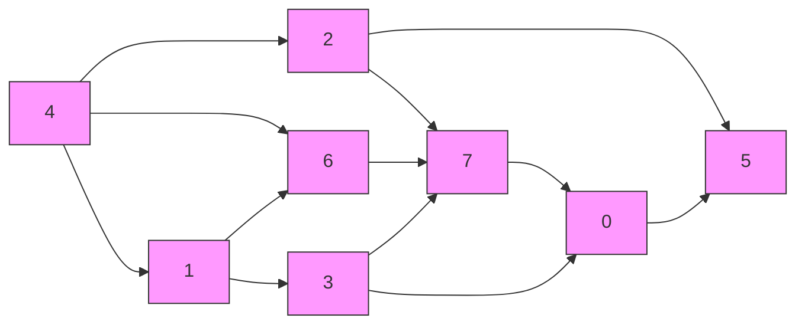
