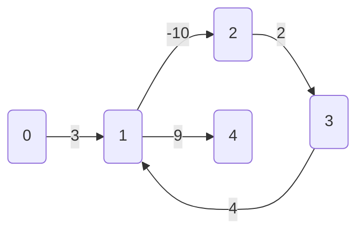
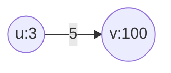
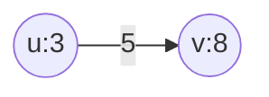
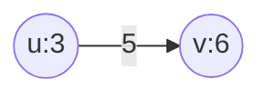

# 最短経路問題

ss14では重み付きの有向グラフのみを考えるものとする。
また基本的には`単一始点最短路問題`を考えるものとする。

`単一始点最短路問題`とは有向グラフ $G = (V,E)$ 上の1点(始点) $s \in V$ が与えられて $s$ から各点 $v \in V$ へ至る最短経路を求める問題として定義される。

## 負辺と負閉路

負の重みを持つ辺を`負辺`という。

負の重みを持つ辺はその辺を通ることでコストの削減につながる"ボーナス"が得られる経路と考えることができる。
長さが負の閉路を`負閉路`という。
この`負閉路`は同じ閉路を何周もすることでコストをいくらでも小さくすることが可能になってしまうため注意が必要である。

負閉路がある場合の例: 一周するごとに-4コストを減らすことが可能である


トポロジカルソートが可能なグラフであるDAGではどの辺から緩和して行けばよいかが自明であるためである。(動的計画法)
しかし、閉路を持つグラフではどの辺から順番に緩和を行っていけば良いかわ自明ではない。

### 緩和

暫定値`a`を次の候補`b`と比較して`a > b`なら `a = b`とする。C++のtemplate関数では以下のように実装できる。

```C++
template<class T> bool chmin(T& a, T b) {
    if(a > b) {
        a = b;
        return true;
    }
    else return false;
}
```

Rustでは以下のように書ける(`T`に対してトレイト境界`std::cmp::PartialOrd`が必要)

```Rust
fn chmin<T>(a: &mut T, b: T) -> bool 
where T: std::cmp::PartialOrd 
{
    if *a > b {
        *a = b;
        true
    } else {
        false
    }
}
```
始点 $s$ から 各頂点 $v$ への最短経路の値を d[v]で管理し、各辺に対して緩和を繰り返していく。 

$$
d[v] =
\begin{cases}
\infty && (v \ne s) \\
0 && ( v = s )
\end{cases}
$$

辺 $e = (u,v)$ に対する緩和は

$$
\text{chmin}(d[v], d[u] + l(e))
$$

でdの値を更新していく。

d[v] = 100と d[u] + 5 = 3 + 5 = 8を比較して小さい方の8を選ぶ



d[v] = 6と d[u] + 5 = 3 + 5 = 8を比較して小さい方の6を選ぶ



## DAG上の最短経路問題: 動的計画法

グラフがDAGでグラフ全体をトポロジカルソートすることで、緩和すべき辺の順序が明らかとなる。
このトポロジカルソートで得られた順番で各辺を緩和していけば各頂点における最短経路を求めることができる。

## ベルマン・フォード法

`ベルマン・フォード法`では、もし始点 $s$ から到達可能な負閉路が存在するならば、その旨を報告し、負閉路が存在しないならば各頂点 $v$ への最短経路を求めるアルゴリズムで、
辺の重みが負の場合でも適用が可能である。

### ベルマンフォード法のアイディア
DAGでない場合ではどの順番に各辺の緩和処理を行っていけばよいか(辺緩和順序)が分からない。
そこで、各辺に対して緩和を行う処理を現在の最短経路の推定値 $d[v]$ が更新されなくなるまで反復することを考える。
実は、 $|V| - 1$ 回の反復によって $d[v]$ は真の最短経路に収束し、 $|V|$ 回目の反復では $d[v]$ は更新されないことを示すことが可能である。
また、逆に始点 $s$ から到達可能な負閉路を持つならば $|V|$ 回目の反復でもある辺 $e = (u,v)$ が存在して、辺 $e$ に対する緩和によって $d[v]$ の値が更新されることを示すことも可能である。

### 正当性
負閉路が存在しない場合では、最短経路はパスであることをすなわち"一筆書き"であることを要求しても良い。
このとき、最短経路に含まれる辺は高々 $|V| - 1$ 本である。
そのため、各頂点に対する緩和を行うと一回のループで少なくとも一頂点への最短距離が求まるため、これを $|V| - 1$ 回繰り返せば各頂点への最短距離が求まる。

また、始点 $s$ から到達可能な負閉路を $P$ として、この $P$ を構成する各頂点 $v_0,v_1, ..., v_{k-1},v_k = v_0$ としたとき、 
$P$ に含まれるすべての辺について更新が行われなかったと仮定すると、 辺 $(v_{i},v_{i+1})$に対する緩和は

$$
d[v_{i+1}] = \min\{d[v_i] + l((v_i, v_{i+1})), d[v_{i + 1}]\}
$$

で行われ、更新が行われないため

$$
\begin{align*}
&d[v_{i + 1}] > d[v_i] + l((v_i, v_{i+1})) \\
&d[v_{i + 1}] - d[v_i] > l((v_i, v_{i+1}))
\end{align*}
$$

よって

$$
\begin{align*}
l(P) &= \sum_{i=0}^{k-1} l((v_i, v_{i+1}))\\
     &\ge \sum_{i=0}^{k-1}(d[v_{i+1}] - d[v_i])\\ 
     &= 0  
\end{align*}
$$

これは $P$ が負閉路であることと矛盾する。よって $|V|$ 回目の反復時には必ず更新が発生する。


<!-- ダイクストラはまだドラフト -->
## ダイクストラ法

辺の重みが正のときのみ使える
