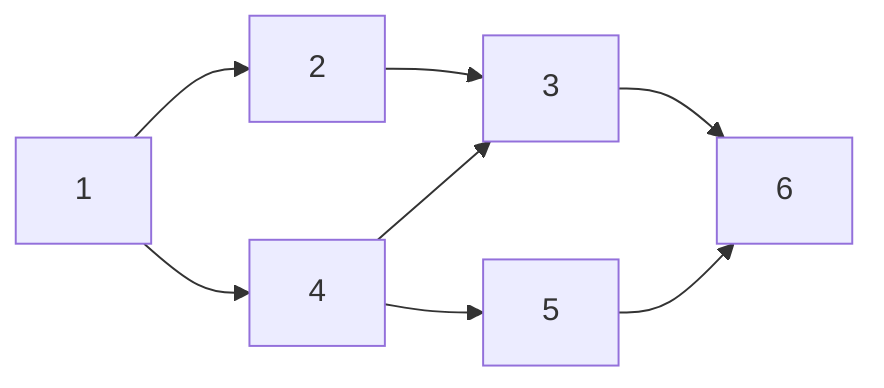

# ネットワークフロー 

## グラフの連結度  

- 有向グラフ $G(V,E)$ において頂点 $s$ から互いに辺を共有しない $t$ までのpathの本数を辺連結度という。
- 互いに辺を共有しないことを辺素であるという。
- 有向グラフ $G(V,E)$ のうち頂点の集合 $V$ を２つの集合 $S,T$ に分割するときこれを $V$ のカット $(S,T)$ という。
- カット $(S,T)$ に対して $S$ に始点を持ち $T$ に終点を持つような辺の集合をカットセットという。
- カットセットに含まれる辺の数をカットセットの容量といい、 $c(S,T)$ という。
- $V$ のカット $(S,T)$ のうち頂点 $s,t$ が $s \in S, t \in T$ をみたすようなものを $s-t$ カットという。

## 最小カット問題

有向グラフ $G(V,E)$ とその頂点 $s,t \in V$ を考える。$s-t$ カットのうち容量が最小なものを求めよ。

これはグラフ $G$ 上で最小本数の辺を取り除くことで $s-t$ 間を分断する問題と言える。

この問題については以下の性質が成り立つ。

- 辺素な $s-t$ パスの最大本数 $\le$ $s-t$ カットの最小容量

    - 題意は辺素な $s-t$ パスが $k$ 本であるとして $c(S,T) \ge k$ を示せばよい。
    - $s-t$ カット $(S,V)$ に対して辺素な $s-t$ パスが $k$ 本横切るので $s-t$ カット $(S,T)$ に含まれる辺は少なくとも $k$ 本以上であるので $c(S,T) \ge k$ 。

この性質を弱双対性という。

辺素な $s-t$ パスが $k$ 本存在し、ある $s-t$ カットが存在してその容量 $c(S,V)$ が $k$ ならば

- 辺素な $s-t$ パスの最大本数が $k$ 本
- $s-t$ カットの最小容量が $k$ 本

であるので

- 辺素な $s-t$ パスの最大本数 $=$ $s-t$ カットの最小容量

## 最大流問題
