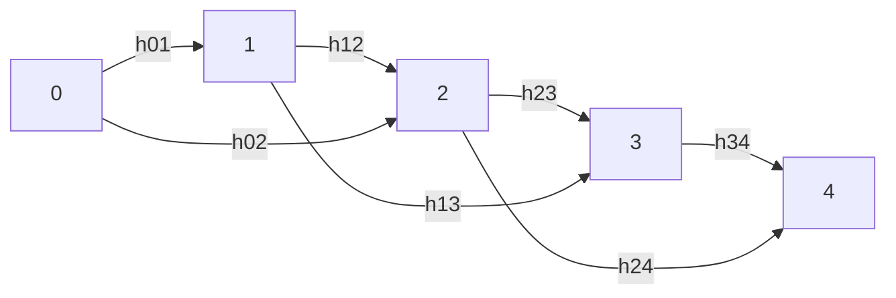
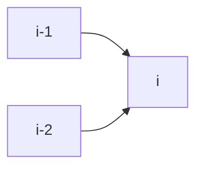
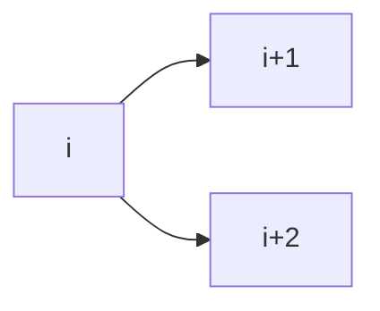
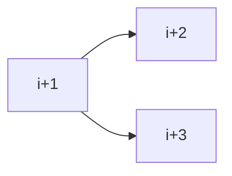

# 動的計画法

## カエル飛び 

- dp[i]: $i$におけるコスト 
    - dp[0] = 0 : $i$ = 0でのコストは0 

コストの更新の方法には以下の二通りの方法がある。

### 貰う形式と配る形式

- 貰う形式
    - $i-1,i-2$から$i$への遷移を考え小さい方を採用する
    - dp[i] = std::min(dp[i-1] + abs(h[i] - h[i-1]), dp[i-2] + abs(h[i] - h[i-1])) 

- 配る形式

    - $i$から$i+1,i+2$への遷移を考える。それぞれの遷移を行う際に$i$との比較を行い小さい方を採用する。

### 緩和

まず配列dpを全て十分に大きな値INFで初期化しておき$i$を増やしてながらdp[i]を更新していく。

このような一度"大きな値で初期化"されたものを小さな値へ更新していく様子から緩和という。

## ナップザック問題 

- dp[i][w] : $0,1,..,i-1$までの品物の中から何個か選び、重さを$w$以下にしている状態

## 編集距離

- dp[i][j]: Sの最初の$i$文字とTの最初の$j$文字との間との間の編集距離
    - 初期条件: dp[0][0] = 0
- 配列dp[i][j]において
    - 右への移動($j$ -> $j+1$): Sへの挿入
    - 下への移動($i$ -> $i+1$): Sの文字の削除
    - 右下への移動($i$ -> $i+1$, $j$ -> $j+1$): Sの文字の(うちコストが1)変更 

## 区間
